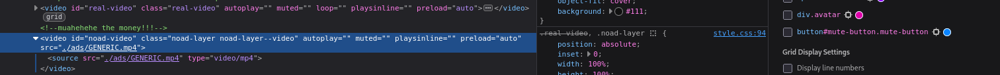
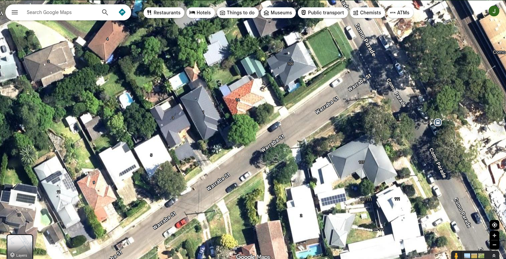
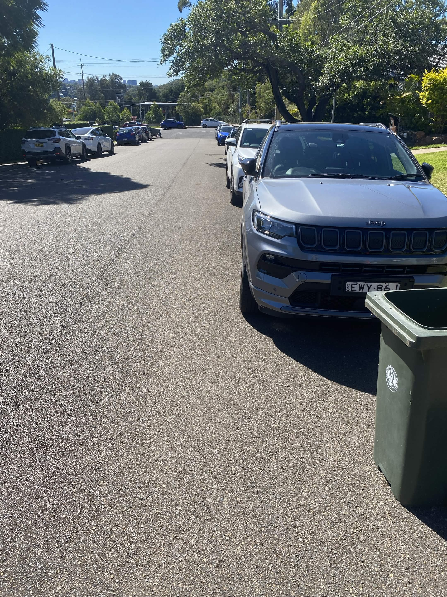

# CTF SECSOC 2026 Writeup

# Setup

### Challenge Description

```
Welcome to SCONES CTF!

If you haven't already, please read the [rules](https://ctf.secso.cc/).

If you're new to CTFs, you should read through the attached info.md file. It contains a bunch of info that'll help you get up to speed.

Finally, some challenges will require you to create an instance (i.e. start a server for you to connect to). You can do that by going to https://instancer.secso.cc/ and clicking start on the challenge you want to create an instance for. This will give you a port number. You should use the connection command/URL given by the challenge, but replace {INSTANCER_PORT} with this port.

Oh, by the way here's the flag for this challenge: SCONES{g00d_1uck_h@ve_fun!}. Submit it below!
```

Flag: SCONES{g00d_1uck_h@ve_fun!}

# Beginner

## Metube

### Challenge Description

```
i think we can sneak a couple of extra unskippable ads into our platform...the viewers won't notice right??

Connection URL: https://metube.secso.cc
```

### Thinking Steps

We see the advertisement located in the video.


Then, we need to remove the next advertisement, by inspecting the element.

This element should be deleted and we should see the flag:



Video:


**Flag: SCONES{now_u_can_lock_in}**

## myMarks

### Challenge Description

```
We here at IT united pride ourselves in your security, we even hired an up and coming dev Cameron, we're so secure we'll even tell you his id number, 2142099!

Connection URL: https://marks.secso.cc
```

### Thinking Steps

This is an IDOR vulnerability, so we can modify the ID.

Visiting the link, it is clear that we see the plain HTML text:

```
myMarks Homepage

What's a page redirect?

Click Here! to get to your marking hub
```

When you click `Here`, it redirects to this: https://marks.secso.cc/1075222/marks

Hmmm, We get the ID from the challenge, so we can modify the number from the URL.

It will be like this: https://marks.secso.cc/2142099/marks

Okay. But I still can't see the page.

```
this aint yo page 1075222
if you were 2142099 you could view this page
```

We can modify the cookies of the webpage, by going to the developer tools and change the id from the URL to the id from the description (Replace 1075222 to 2142099).

After that (at the very bottom), we get a unique description:

```
...
WAM: 24.00

WUh Oh! Somebody call the WAMbulance!

SCONES{Our_Sekurity_1z_top_n0tch}
```

**Flag: SCONES{Our_Sekurity_1z_top_n0tch}**

## not nano

### Challenge Description

```
only true 1337 h4x0rs will be able to solve this challenge
```
`ssh -o StrictHostKeyChecking=no -o UserKnownHostsFile=/dev/null -p {INSTANCER_PORT} ctf@chal.instancer.secso.cc`
```
password=hunter2, Instancer: https://instancer.secso.cc
```

### Thinking Steps

We can type `:q!` to exit vim, then change the directory into the main directory (`/`).

Then, we get the file called `flag`:

```bash
ctf@057c1600131e:/$ cat flag 
SCONES{th3y_$a1d_it_was_imp0ssibl3}
```

**Flag: SCONES{th3y_$a1d_it_was_imp0ssibl3}**

## HFT

### Challenge Description

```
will has found an infinite money glitch: 100x leveraged options trading. you've decided to copy this brilliant strategy, let's see how it turns out for you...

Connection command: nc chal.secso.cc 5000
```

### Thinking Steps

We know the sample source code given below:

```python
...
for i in range(25):
    print("the markets have shifted...")
    inp = input(" buy or sell? ")
    ans = random.randint(0, 1)

    if inp not in ["buy", "sell"]:
        print("market manipulation detected")
        exit(1)

    if (inp == "buy") == (ans == 0):
        continue

    print(f"you are now {seed} quintillion dollars in debt")
    exit(1)
    ...
```

We need to avoid the last 2 lines, which exits the program.

I got stucked and asked someone who gets to solve the challenge, which said that it needs to find the seed and generate it yourself from the random integers.

Instead of focusing on the loop, we can focus on the other source code:

```python
import random
import time

seed = int(time.time())
random.seed(seed)
...
```

We can print the seed, from the time given, and loop it.

```python
import random
import time

seed = int(time.time())
random.seed(seed)

for i in range(25):
    print(random.randint(0, 1))
```

Btw, it needs to be fast in both switching and typing the numbers.

Tip: Use `alt + tab num` to switch terminal context.

If we do it fast enough, we get the flag:

```
well played, options goat
SCONES{1t_w4s_luck_4ll_4l0ng...}
```
**Flag: SCONES{1t_w4s_luck_4ll_4l0ng...}**

## scones cafe

### Challenge Description

```
Wow look at this awesome website i sure would love to order some SCONES! hopefully they didnt leave many crumbs lying around.

Note: This challenge will be walked through at the Intro to CTFs workshop (10am-12pm).

Connection URL: https://cafe.secso.cc
```

### Thinking Steps

What other directories that it has? Robots.txt?

Okay. We got access. 

`/robots.txt`:

```
User-agent: *
Disallow: /reports/
Disallow: /admin/
Disallow: /data/flag.txt
Allow: /static/
Allow: /templates/
```

When we access to the `/data/flag.txt`, we get a 404 response code.

I opened the hint, which is said below:

```
Use robots.txt to find the directory structure, location of flag.txt and the existance of an admin route. Log in using the staff creds left inside the login page html code. Intercept the get request when attempting to access the admin page, decode the auth cookie from base64, change the admin flag from 0 to 1, re-encode it and forward the request. Escape out of reports directory and into the flag.txt using the payload "../data/flag.txt".
```

Well, this is "free flag", which means the hint provides the instructions to get into the challenge. We will use burpsuite for intercepting.

When we visit the login page, we get the details of the source code:

```html
...
<form method="POST">
    <!-- Temp staff login: Username: staff1 Password: Scones2026) -->
    <input type="text" name="username" placeholder="Username" required><br>
    <input type="password" name="password" placeholder="Password" required><br>
    <button type="submit">Login</button>
</form>
```

We get the username and password. --> Get through the admin page.

We turn on the intercept.

After turning the intercept on, we get into the admin page.

There, we found an input: `reports/`.

We insert  `../data/flag.txt` to obtain the flag, escaping through the reports directory and obtain the `flag.txt` contents.

We get the content: `flag = SCONES{5sconesand5morescones}`

**flag: SCONES{5sconesand5morescones}**

## Funni Primes 

### Challenge Description

```
help! our keyserver only generates funni primes and it keeps reusing them! the flag's under key 0.

Connection command: nc chal.secso.cc 5001
```

### Thinking Steps

We can use PARI/GP to find the flag.

Use the `gcd` command in PARI/GP to find the shared prime (Not 1!)

Then, we divide `n0` with the shared prime. 

After that, We can compute the eulerphi.

Then, we can compute the decryption key by:

$ d \equiv e^{-1} \mod \phi(N)$

We can use the $e$ and $\phi(N)$ to get the message.

Command in PARI: Mod($e$, $\phi(N)$)^-1, to get the inverse.

If we answer all the questions, then we can obtain the flag:

```
you broke key 0! here's the flag:
SCONES{s1x_s3v3n_sh4r3d_pr1m35}
```

**flag: SCONES{s1x_s3v3n_sh4r3d_pr1m35}**

## council of bread

### Challenge Description

```
My friend recently went to go buy some bread and sent this photo on his way. What street is he on? Format: All caps, just the name of the street eg. if you thought the answer was Barker St, the flag would be SCONES{BARKER}

Note: This challenge will be walked through at the Intro to CTFs workshop (10am-12pm).
```

### Thinking Steps

There is a hint available:

```
on the bin you can see that we're in Sutherland council.

then if you zoom in on the background you can see a train station. based on the train stations in Sutherland council and the length of the name you can figure out that this is Como station.
```

Hmm, if we look it up on the gmaps and locate como station, there is the trees located in the back of the station, which is located in the image given.

Here is the map view:



Then, we can view from the image given itself:



It is clear that the name of the road is Warrata.

So, the flag will be: `SCONES{WARRATA}`

## cameron's reels

### Challenge Description

```
when you know bro's hiding smth in his reels but you can't quite prove it...

Connection command: nc chal.secso.cc 3002
```

### Thinking Steps

There is a hint, but it is clearly a buffer overflow vulnerability.

We can just test a lot of character "a" in the input field.

We tested it and this is the result:

```
please input the password: aaaaaaaaaaaaaaaaaaaaaaaaaaaaaaaaaaaaaaaaaaaaaaaaaaaaaaaaaaaaaaaaaaaaaaaaaaaaaaaaaaaaaaaaaaaaaaaaaaaaaaaaaaaaaaaaaaaaaaaaaaaaaaaaaaaaaaaaaaaaaaaaaaaaaaaaaaaaaaaaaaaaaaaaaaaaaaaaaaaaaaaaaaaaaaaaaaaaaaaaaaaaaaaaaaaaaaaaaaaaaaaaaaaaaaaaaaaaaaaaaaaaaa


womp womp cameron's too secure
expected `logged_in` variable to be set to : 0x69696969
current `logged_in` variable set to : 0x61616161

============= SYSTEM STACK =============
0x7ffcd179fc10     rbp-112	0x6161616161616161  <- password
0x7ffcd179fc18     rbp-104	0x6161616161616161
0x7ffcd179fc20     rbp-96	0x6161616161616161
```

Hmmm, it tells that 61 = a

If 61 = a, then 69 = ?

We add 8 more characters, which is "i".

Let's try it.

Hmm, it just filled only the top ones.

We need to fill until the bottom ones.

Stack:

```
============= SYSTEM STACK =============
0x7ffe946e26d0     rbp-112	0x00007513840a15c0  <- password
0x7ffe946e26d8     rbp-104	0x0000751383f45c33
0x7ffe946e26e0     rbp-96	0x000000000000000b
0x7ffe946e26e8     rbp-88	0x0000610614e99155
0x7ffe946e26f0     rbp-80	0x00007513840a15c0
0x7ffe946e26f8     rbp-72	0x0000751383f3b77a
0x7ffe946e2700     rbp-64	0x0000000000000000
0x7ffe946e2708     rbp-56	0x000075138409f030
0x7ffe946e2710     rbp-48	0x00007ffe946e2878
0x7ffe946e2718     rbp-40	0x00007ffe946e2740
0x7ffe946e2720     rbp-32	0x0000000000000000
0x7ffe946e2728     rbp-24	0x00007ffe946e2740
0x7ffe946e2730     rbp-16	0x00007ffe946e26d0
0x7ffe946e2738     rbp-8	0x0000676714e9833c  <- logged_in
0x7ffe946e2740     rbp+0	0x00007ffe946e2760  <- saved RBP
0x7ffe946e2748     rbp+8	0x0000610614e985ea  <- saved RIP
```

We want to overflow until the logged in state.

So, we fill 8*13 "i" characters.

To do that, we can use python to print 114 "i" characters:

```python
a = "i"
print(a)*114
```

It prints the "i" 114 characters long.

Then, we get these options:

```
welcome cameron...

=============================================================
=========================== Reels ===========================
=============================================================

1.	Cocktailz
2.	Animalz
3.	Femboiz
```

Pick number 3 for the flag.

Now, we get the flag:

`SCONES{w4it_why_1s_1t_4_c0ok1e5_4nd_cr3am_tut0ri4l???}`

**flag: SCONES{w4it_why_1s_1t_4_c0ok1e5_4nd_cr3am_tut0ri4l???}**