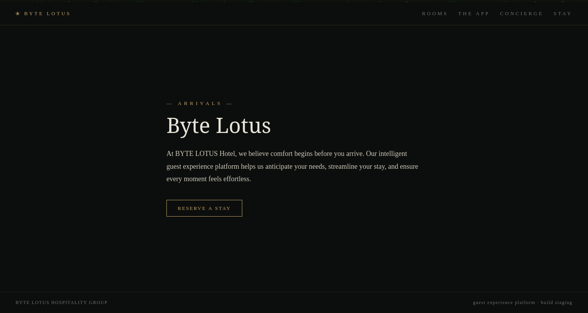

# Room 404 - Day 2 Hacker Holidays Series

[Link](https://tryhackme.com/room/hh-room404-804573bf)

# Thinking steps

Target: `<IP>:8080`

When visited, it is just a regular web page.



As usual, we need reconnaissance for every single target that we have found. Because the target is the web server, we need to find hidden directories that may be useful for our findings.

We use the tool `gobuster` for this one.

`gobuster dir -u http://<IP>:8080 -w /usr/share/wordlists/SecLists/Web-Content/Discovery/common.txt -x bak,txt,php -t 100`

`-t <num>` is to speed things up.

```
...
===============================================================
.git/config          (Status: 200) [Size: 92]
.git/index           (Status: 200) [Size: 289]
.git/HEAD            (Status: 200) [Size: 21]
.git/logs/           (Status: 200) [Size: 165]
.git                 (Status: 200) [Size: 437]
Progress: 19000 / 19000 (100.00%)
===============================================================
...
```

Found a `.git` repo. 

At this moment, I tried to open every single file in the `.git` repo located in the target, but it did not provide any flags.

I deep into rabbit hole of deep diving into the the `.git` folder in the web for a few hours.

So, I lookup on medium [link](https://medium.com/@KuberaKrishna/tryhackme-hackers-holiday-day-2-room-404-write-up-b9cd8b6050ff) and found a tool that I never heard before: `git-dumper`. This tool basically dumps all the content of the exposed `.git` folder in the website, including the index files.

Knowing that, I try to know how to use the command, just running the command: `git-dumper`.

```
usage: git-dumper [options] URL DIR
git-dumper: error: the following arguments are required: URL, DIR
```

So, we must provide the URL and the directory of the .git folder.

`git-dumper http://<IP>:8080 .git/`

And we get the new folder called `.git` in our system.

When we explore the contents of `.git`, we found a readme file, which contents contain the flag:

```
# Byte Lotus — Guest Experience Platform

Internal staging repository for the guest app and concierge personalization
service. Do not deploy this folder to production.

Staging flag (remove before launch): THM{byt3_l0tus_n3v3r_f0rg3ts}
```


