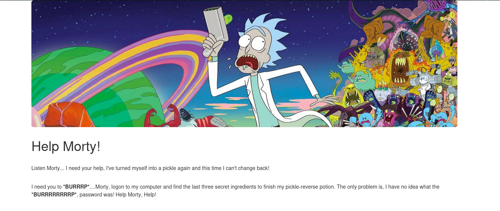
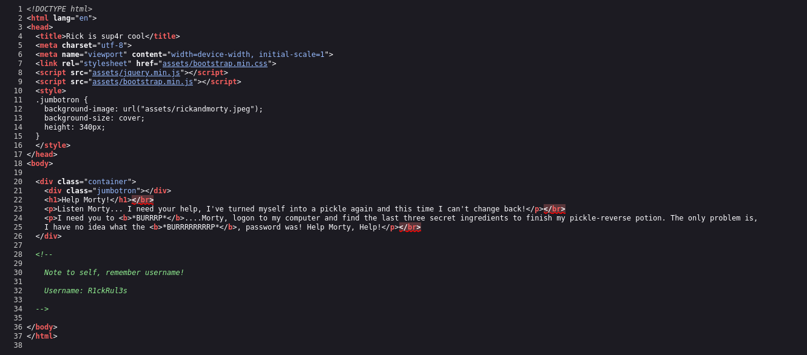
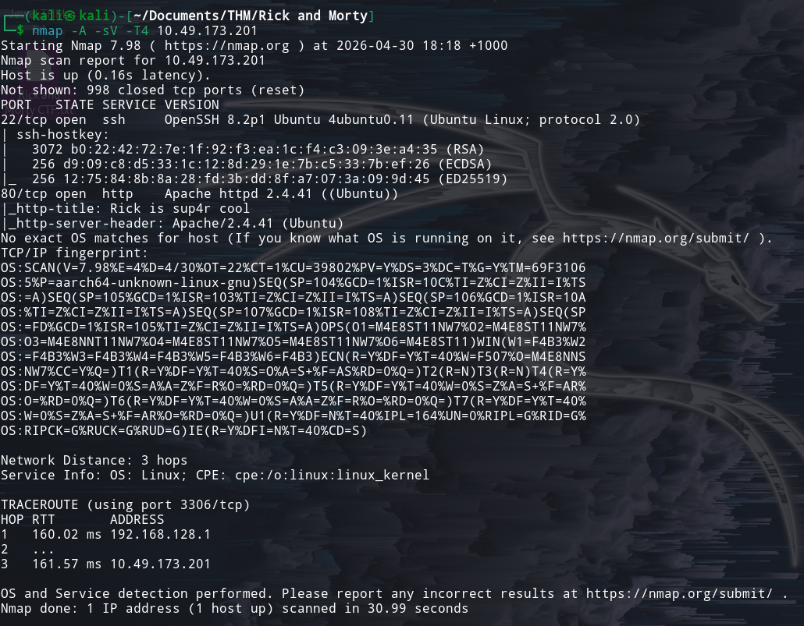
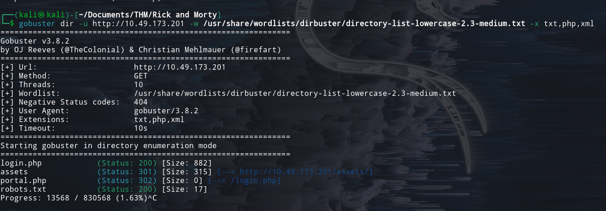
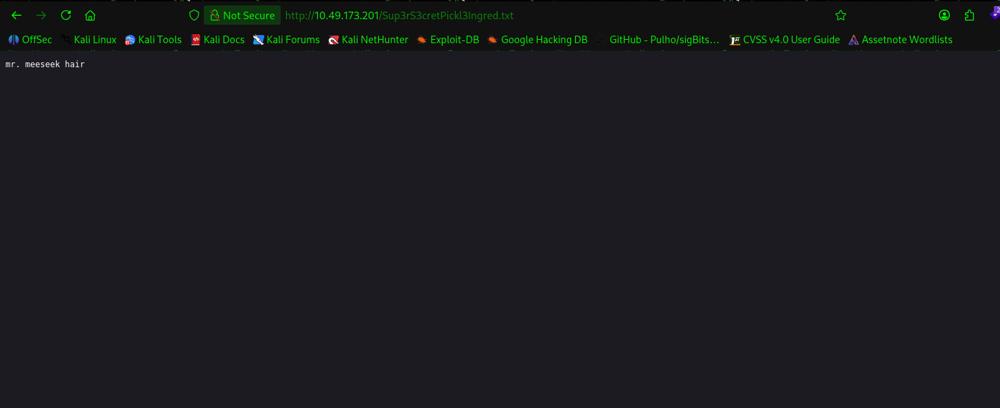
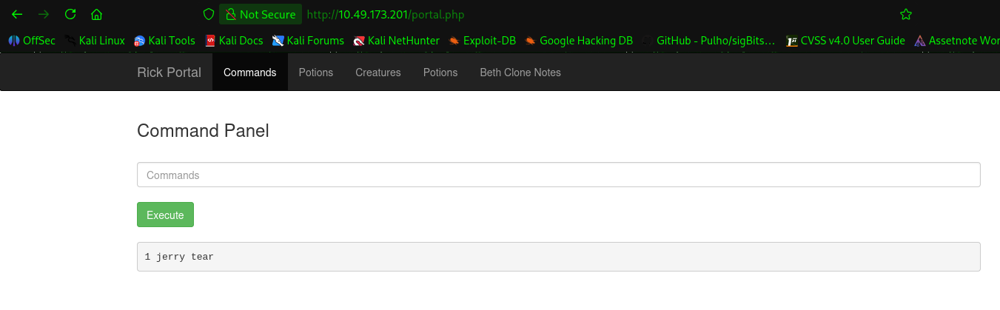
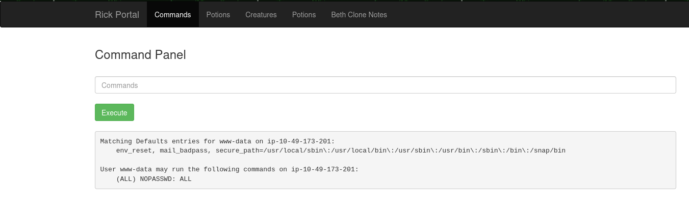
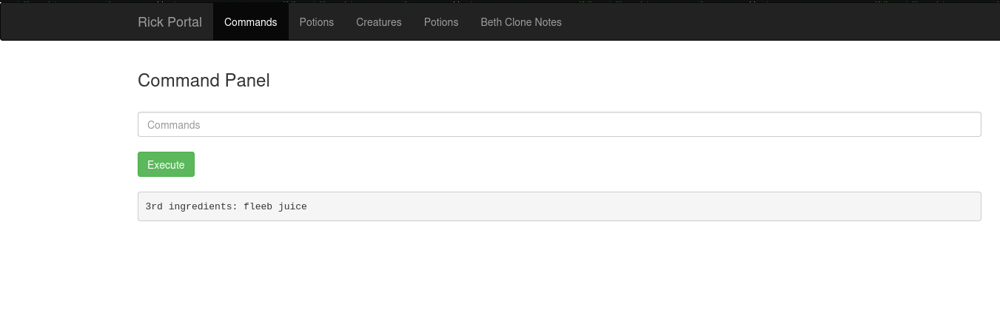

# Pickle Rick CTF Capstone challenge

[Room Link](https://tryhackme.com/room/picklerick)

## Description challenge

This Rick and Morty-themed challenge requires you to exploit a web server and find three ingredients to help Rick make his potion and transform himself back into a human from a pickle.

Deploy the virtual machine on this task and explore the web application: IP

## Summary

This room is a capstone room to prove the skills in web application cyber security. It evaluates the ability to learn the patterns of a penetration tester. 

## Technical details & evidence (Step-by-step walkthrough)

The first step here is visiting the main page. 



Based on what I think, it wants the user to utilise burpsuite to intercept any pages. 

After setting the app up, I tried to inspect the website to gain more information. It provides an additional information here:



as well as other directories in the webpage. One of which is assets/rickandmorty.jpeg.

This is where I fell into the rabbithole of finding clues behind all of the images in the `assets` directory. 

Until, I checked my notes about hidden directory. The hidden directory is: `robots.txt`. It contains something interesting: `Wubbalubbadubdub`.

Also, I look for other information: using `curl`, `sitemap.xml`, and `favicon.ico`. After 1 to 2 hours of investigating, it returns that it is based on `icons` directory. It returns a forbidden (403) status code.

After a few minutes, I realised that I have not enumerate the network. So, I launched nmap and try to scan the website for open ports.



Just an SSH port and the HTTP port. 

In addition, I also launched gobuster to enumerate other directories. The command to run is: `gobuster dir -u IP -w /usr/share/wordlists/dirbuster/directory-list-2.3-small.txt`

It returned only the `assets` directory.

This is where I got stuck on solving this challenge. 

I looked the walkthrough about the challenge online and trapped into the rabbit hole for a few hours (Figuring how to login into SSH target, but got refused due to cryptography), realising that it deals with the directory scanning command. 

From the command above, it does not have the extensions, such as `.php`, `.txt`, etc.

This is where I got tripped up. 

From there, I added the extension to command: `gobuster dir -u IP -w /usr/share/wordlists/dirbuster/directory-list-2.3-small.txt -x php,txt`

Now, it returned some results. 



The login seems interesting, it is a login page that has the username and password field. 

From the information retrieved above, we can login with these credentials:

```txt
Username: R1ckRul3s
Password: Wubbalubbadubdub
```

Okay, we logged into a webshell, where it runs a Linux command. 

We can list the files, but the contents cannot be read.

It returns this error when I ran `cat Sup3rS3cretPickl3Ingred.txt`

<video width="640" height="360" controls>
  <source src="./Assets/5.mp4" type="video/mp4">
  Your browser does not support the video tag.
</video>


After trying the bash built-in commands, it still not work. End up looking for a writeup for other clues.

The writeup wrote that it utilises the search bar, since the file is located at the same directory. 

I got confused and realised simultaneously because all of the files listed are in the same directory, so no wonder it utilises the search bar. 

I learned that if the command in the webshell is not working, then search bar may help if you want to look at the files in the same directory as the URL. 

From there, I obtained the first flag. 



Now, I tried to use path traversal to find the second flag. The second flag is located at `/home/rick`. 

I cannot figure on how to obtain the contents other than cat. So, I look the other commands online.

Until I realised on a digital forensics challenge, where I used strings to find the keyword in the content.

From there, I tried to apply it here and it works here. Got the second flag.



Now, the third flag is located on the root directory, based on my intuition, since root directory is listed on the main directory `/`. 

I tried running the command `cd /root; ls -las`, it just shows the same content at the home page.

I also tried running root privileges: `sudo su; whoami`, it just returns `www-data`. 

Hmm, If `sudo su` is not working, and going through the `/root` also not work, what else do I need to do? 

Again, I look the writeup for clues and you need to show root privileges, `sudo -l`. 

I also do not understand what `sudo -l` means, but after reading about it, it says that it lists user privileges.

Here is the results of running the command `sudo -l`:



Now, since it says sudo can be run as a user, it means that this user can run `sudo cmd`.

So, I tried running `sudo cd /root; ls -las` and it returned the same directory.

Then, I tried running `sudo ls /root` to view the contents of `/root` directory and view the content using `strings`.

command: `sudo strings /root/3rd.txt`



## Impact

The impact of this attack is that the threat actor is able to gain access through the command line interface. With the knowledge of Linux and web fundamentals, the attacker may gain access to view passwords and usernames of the owner.
